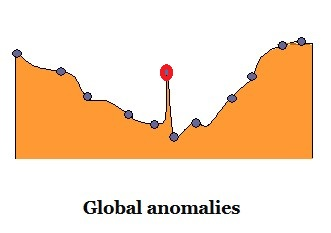
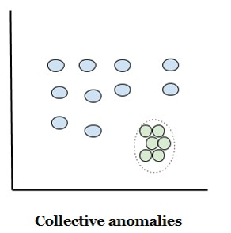
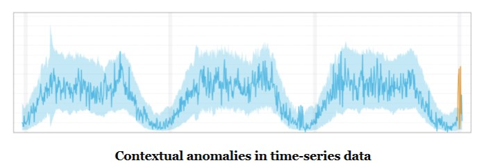

# Anomaly-Detection
How to detect anomalies in a dataset
Anomaly detection has shown to be a valuable tool in a variety of application domains, e.g. detecting credit card fraud, network intrusion and sensor malfunction.

Anomalies are defined as patterns in data that donot conform to expected or normal behaviour. The problem of finding such patterns is referred to as anomaly detection. Anomaly detection can be applied to any type of data,binary,discrete or continuous, univariate or multivariate.

 ## Types of anomalies
 
 
 There are mainly three types of anomalies,  
 
 
* point anomalies (global anomaly ):Point Anomalies If a single point deviates from the considered normal pattern it is referred to as a point anomaly. This is the simplest form of an anomaly and is the most researched form. An example of a point anomaly is if a process value suddenly is very low or high. An illustration of this is given below Figure, where the anomaly is marked in red.

* sequential anomalies:If a sequence or collection of points is anomalous with respect to the rest of the data, in the following figure, the data points marked in green have collectively formed a region which substantially deviates from the rest of the data points.

* contextual anomalies:If a point or a sequence of points are considered as an anomaly with respect to its local neighbourhood, but not otherwise, it is referred to as a contextual anomaly.
Consider today’s temperature to be +20 degrees centigrade and we are in Alaska. Is the temperature normal today? This is a highly relative question and demands for more information to be concluded with an answer. Information about the season, location

 

 Notice:The values have not fallen outside the normal global bounds, but there are indeed abnormal points (highlighted 
in orange) when compared to the seasonality.

 ## Anomaly detection Methods:
 
The anomaly detection problem has been investigated in many different fields of mathematics and with different application areas. Anomaly detection was first research in the field of statistics as outlier detection. Lately the statistical approaches have been expanded by machine learning methods. Hodge and Austin [1] gives an extensive survey of these anomaly detection techniques. Recently other approaches have been explored such as neural networks presented by Markou [2]  and methods for cyber-intrusion detection.

What is similar for all anomaly detection techniques is that they consists of two parts,atraining phase and detection phase. During the training phase,the anomaly detection uses a set of training data to define a model which specifies what is considered normal and/or abnormal with respect to the training set. In the detection phase, new or incoming data is classified using the model from the training phase. 

## Learning methods in anomaly detection:

The type of data available influences what anomaly techniques that can be applied. There is a main difference in the types of data,labelled or unlabelled data instances. For labelled data there are labels associated with each data point which gives information if the instance is normal or abnormal. For unlabelled data instances there is no such information. From the type of data available there are three different approaches for the training phase:

### Supervised learning:
When applying supervised learning the system is fed with labelled data on which the algorithm defines what is normal or not. The challenge of supervised learning is that it is usually very time consuming to label data and it is normally hard to include all types of anomalies, which is needed for the algorithm to perform well.

* Advantages – Could use powerful anomaly detection techniques to learn the underlying model – Can be used when anomalies are more frequently occurring than normal instances
* Disadvantages – Time consuming and sometimes impossible to label data – Hard to find labelled data of all possible normal and abnormal instances

### Semi-supervised learning
When applying semi-supervised learning the system is solely fed with points of normal behaviour. This gives the system a way to learn what is normal. Similarly to the supervised learning it is hard to find data points that cover every instance of normality

* Advantages – More widely applicable than supervised learning – Does not need to specify all types of anomalies that might arise
* Disadvantages – Might be challenging to find normal data that covers all normal instance

### Unsupervised learning
Unsupervised learning does not use labelled data. Instead,this method assumes that the normal behaviour is the most frequently occurring. Normal instances are then defined as the most frequently occurring patterns, and points or sequences deviating from these patterns are reported as anomalies.

* Advantages – No labelled data needed – Widely applicable
* Disadvantages – Relies on the assumption that normal instances are far more frequent than abnormal ones 

In conclusion,the learning technique that can be used depends on the available data. If labelled data is available and  it is sufficient to assume that this data represents most of the instances that were given then supervised learning is the most suitable. Semi-supervised learning is used with advantage if it is easy to extract a great variety of normal instances. Unsupervised learning is the only possible alternative if none of the above is applicable.

## Anomaly detection techniques

This section gives an overview of some of the existing anomaly detection techniques with advantages and disadvantages of each approach:

### Classification based

The majority of classification based anomaly detection techniques runs in a supervised or semi-supervised environment. It uses a training set of labelled data to learn a model or classifier. This model is then used to classify new or incoming points. The classification-based techniques rely on the assumption that it is possible to distinguish between normal and anomalous points in the given feature space. Examples of classifiers are Neural Networks, Bayesian Networks, Support Vector Machines, which is programmed in the jupyter notebook and Rule-based classifiers.

* Advantages – Powerful algorithms can be used to distinguish between instances – Low time complexity of the detection phase
* Disadvantages – Needs labelled data – Computationally heavy training phase – Usually returns binary results, i.e. no level of anomaly is available. 

### Clustering based
The clustering-based method groups similar points of the data to form clusters. The clustering-based method can be divided into three categories as they rely on different assumptions. 

The first clustering-based method relies on the assumption that normal points belong to a cluster and anomalous points do not. Thus it is sufficient to determine if a point to be classified belongs to a cluster or not.

The second clustering-based method relies on the assumption that normal points lie close their closest cluster centroid while anomalous points do not. In this setup, the centroids of each cluster must be calculated with respect to some measure. The distance to the closest centroid is then the anomaly score for each point. 

The third clustering-based method relies on the assumption that normal data instances belong to clusters that are large and dense while anomalies either belong to clusters that are small or sparse. This technique requires the calculation of the density and size of the clusters. A point is reportedas anomalous if the density and/or size of the cluster it belongs to is below some threshold.

* Advantages – Runs in an unsupervised environment – Low time complexity of the detection phase – Widely applicable, can be used on several data types
* Disadvantages – Depends on the performance of the clustering algorithms – Not optimised for anomaly detection but rather to find clusters – Computationally heavy training phase – Defining distance measure is not always straightforward

###  Statistical approach

The statistical methods for anomaly detection rely on the assumption that "normal data instances occur in high probability regions of a stochastic model, while anomalies occur in the low probability regions of the stochastic model".

The statistical methods could be divided into two types of techniques, parametric and non-parametric. The parametric techniques assume that the normal data instances are generated from a parametric distribution with parameters Θ. If the parameters are unknown, they are estimated from the training set. The anomaly score of a point x is given by the inverse of the probability density function at f(x,Θ). Statistical hypothesis test could also be used to classify data instances.

On the other hand, non-parametric methods do not define the underlying model a priori, but finds the structure from the data. The simplest nonparametric technique uses histograms. A histogram is made from the training data set and the anomaly score of a point is the inverse of the height or the number of other points in the bin it falls into. This method is sensitive to the choice of the bin length.

* Advantages – Runs in an unsupervised environment – If the statistical assumption is true, this technique provides a statistically justified solution – Low time complexity of both the training and detection phase
Disadvantages – Relies on the assumption that data comes from the assumed statistical distribution – Hard to determine the correct test statistic to use – Multivariate anomalies might not be detected

The most suitable anomaly detection technique to use depends on what training data is available and also what restrictions there are on the time complexity. The proposed techniques usually need some modifications when applied in a real life situation

 [1]: Victoria J. Hodge and Jim Austin. “A Survey of Outlier Detection Methodologies”. English. In: Artificial Intelligence Review 22.2 (2004), pp. 85–126.
 
 [2]: M. Markou. “Novelty detection: a review—part 2: neural network based approaches”. English. In: Signal Processing 83.12 (2003), pp. 2499–2521.
 
 Moa Samuelsson."Anomaly Detection In Time Series Data",Gothenburg, Sweden 2016

